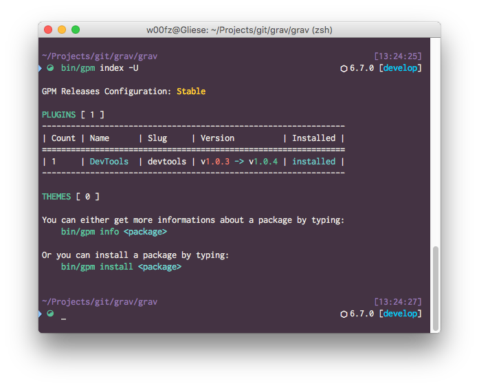

# My Oh-My-Zsh Theme (Hedreod Fork)



This theme is based on [Bureau](https://github.com/robbyrussell/oh-my-zsh/wiki/Themes#bureau) and modified. It supports Git and NPM.

## Install and Enable

To install the theme, copy the [`hedroed-bureau.zsh-theme`](hedroed-bureau.zsh-theme) file under `~/.zshrc/themes`.
Then, to enable it, set `ZSH_THEME` to `hedroed-bureau` in your `~/.zshrc`, before sourcing Oh My Zsh.


# My Oh-My-Zsh Plugins
```
plugins=(git brew encode64 phing colorize copydir copyfile dirhistory autojump web-search osx)
[[ -s $(brew --prefix)/etc/profile.d/autojump.sh ]] && . $(brew --prefix)/etc/profile.d/autojump.sh
```

# Improvement

Show python version if a `.py` file is detected in current directory.
Show docker version if a `docker-compose.yml` or a `Dockerfile` is detected in current directory.

Show current virtualenv name.
Show if a proxy is set in HTTP_PROXY env.


# Sources

https://github.com/unixorn/awesome-zsh-plugins#themes
https://github.com/zero-frost/docker-zsh-theme
https://github.com/dersam/staples
https://github.com/w00fz/w00fz-bureau.zsh-theme
https://github.com/ryanoasis/nerd-fonts
https://wiki.parabola.nu/Zsh
https://github.com/agnoster/agnoster-zsh-theme/blob/master/agnoster.zsh-theme#L76
https://symbl.cc/fr/1F433/
